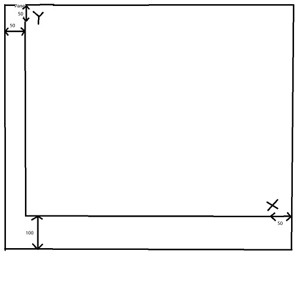
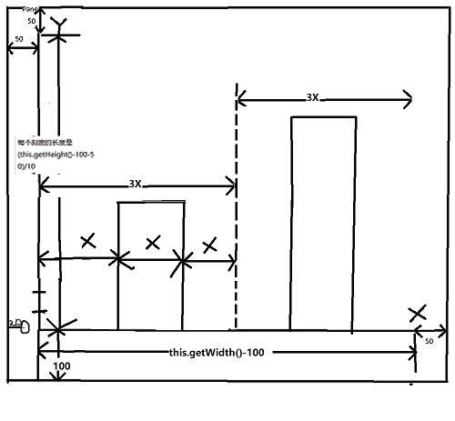

# Readme #

## 新加类的说明 ##

### 1.SaleSystemUI类 ###

`提供给全局的显示类，里面只有一个displayUI方法，外界(包以外)需要创建这个类的实例对象来调用这个displayUI方法来显示整个界面，是整个系统的入口类，当然定义成static方法也可。`

### 2.Manager类 ###

`主要功能实现类，系统的枢纽，他能直接或者间接(调用其他的类的功能实现)地实现主窗口的所有功能，系统最重要的类，里面定义了其他类的实例，采用了组合模式以及一些算法，数据结构来实现特定的功能，他也是主窗口类和其他类之间的桥梁，其他的某些类真正实现了主窗口的某些功能，但是也要经过Manager类来管理分配，因此称呼他为对象的管理员更加合适，管理各个对象，同时实现某些功能。功能的具体实现请看源码，里面有大量的注释。`

## ChartFrame坐标算法 ##

### 1.画轴 ###

<pre>
//前两个参数第一个点的坐标，后两个是第二个点的坐标  
g.drawLine(50, this.getHeight()-100, 50, 50); 
g.drawLine(50, this.getHeight()-100, this.getWidth()-50, this.getHeight()-100); 
</pre>

;

### 2.画刻度(0-100)

<pre>
for(int i=0; i<=10; i++) {
	//第一个参数是画的字串，后两个是坐标
	g.drawString(i*10+"", 20, this.getHeight()-100-(this.getHeight()-150)/10*i);
}
</pre>

;

`每个刻度长度el = (this.getHeight()-150)/10。因此第i个刻度是il = i*el,那么他的坐标从X轴(Y坐标：this.getHeight()-100)算起是-il。
所以用X轴的坐标减il即可。`

### 3.画条形图 ###

<pre>
int x = 0;
for(int i = 0; i < l.size(); i ++) {
	g.setColor(Color.BLACK);
	//得到每个条形图的x坐标
	x = 50+(this.getWidth()-100)/(3*l.size())*(1+3*i) ;
	//在条形图下画对应书的编号
	g.drawString(l.get(i).getBookId(), x, this.getHeight()-80);
	g.setColor(Color.BLUE);
	//计算条形图的高度
	int h = (int)((100-l.get(i).getBookRemain()) * (this.getHeight()-150)/100);
	//画条形图(矩形)
	g.fillRect(x, this.getHeight()-100-h, (this.getWidth()-100)/(3*l.size()), h);
}
</pre>

`X轴长度L = this.getWidth()-100，每个刻度X = L/(3*l.size())，加上前面的50左边距，因此第i个图的x坐标就是
50+(this.getWidth()-100)/(3*l.size())*(1+3*i)，至于高度h,就是销量的百分占比乘以Y轴长度即可，
h=(100-Remained)/100*(this.getWidth()-100)。`

### 4.画图名称 ###

`直接画在下方中间即可，很简单不多说。`

